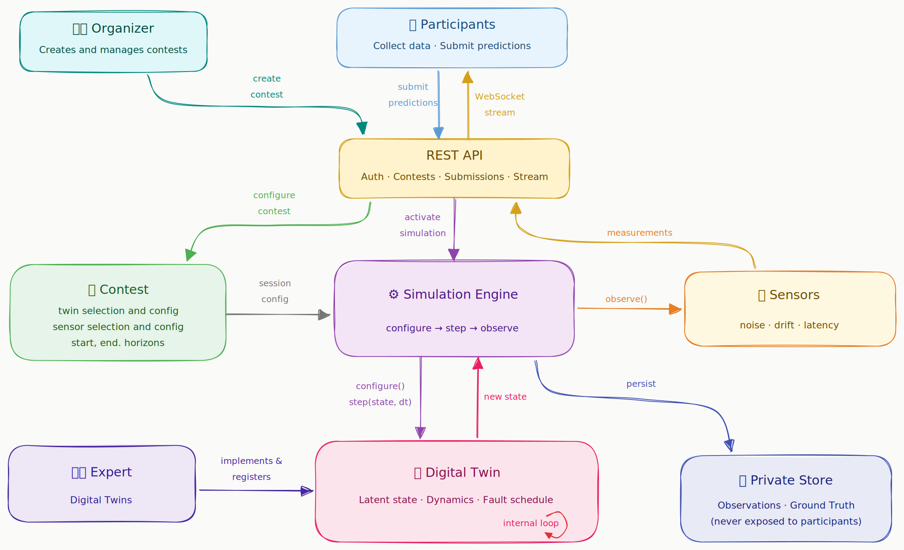

# EPIC - ELIOS Predictive Intelligence Challenge

EPIC is a **competition platform** for predictive intelligence on **live digital twins**. It turns a simulated physical system into a **real-time machine learning challenge**: participants connect to sensor streams, collect their own data, predict a hidden future window, and are scored automatically against ground truth that is recorded by the platform, but never shown to participants.

| Resource      | URL                              |
|---------------|----------------------------------|
| Live platform | https://epic.elioslab.net        |
| REST API      | https://epic.elioslab.net/api/v1 |
| API live docs | https://epic.elioslab.net/docs   |
| SDK           | `pip install epic-elios-client`  |

EPIC is built for classrooms, research benchmarks, and industrial experiments where static datasets are too simple. An **organizer** can choose a digital twin, configure sensors and faults, invite **participants**, run a **contest**, and get a live **leaderboard** without writing backend code.

## Concept

Most machine learning competitions start with a file. EPIC starts with a system. That system is a **digital twin**: a compact simulation of a physical asset such as a mass-spring-damper, a centrifugal pump, an electric motor, a gearbox, a smart building, or any other physical system. The twin evolves in real time on the server following **its internal physics** (e.g. differential equations), **faults** can be scheduled inside the twin and alter the latent physics (e.g. the spring gets weaker, the pump cavitates, the motor overheats). **Sensors** observe the twin's internal state and produce noisy, biased, drifting, delayed, quantized, saturated, and sometimes false or outlying measurements.

Participants only receive the sensor stream. They do not receive the clean state, fault labels, or future observations. EPIC stores those private signals for scoring and keeps the competition honest by closing the stream before the evaluation window is generated. **Participants must forecast the future from what they have observed**.

The result is a richer contest format than a static benchmark. Students and researchers practice the whole **predictive-intelligence loop**: instrumentation, data collection, temporal reasoning, modelling, submission integrity, and live leaderboard feedback.

## Architecture

EPIC separates competition infrastructure from simulated domains:



At runtime, EPIC is a layered RESTfull API application. The API layer handles authentication, contest management, registrations, submissions, leaderboards, invitations, and streams. The database layer stores users, contests, tasks, sessions, observations, submissions, scores, and leaderboard entries. The plugin registries keep digital twins, sensors, scoring metrics, and evaluators decoupled from the platform core, so new simulated systems can be added without rewriting the API. When a contest becomes active, the simulation engine instantiates the selected twin and sensors, runs the live session, streams observations to registered participants, stores hidden evaluation data, and triggers scoring after submissions. The web interface and the client SDK both sit on top of the same REST and WebSocket contract.

## Roles and Account Flow

EPIC has three roles with different permissions:

| Role          | Scope                                                                                            |
|---------------|--------------------------------------------------------------------------------------------------|
| PARTICIPANT   | Join contests, stream data, submit forecasts, get scores.                                        |
| ORGANIZER     | Create and manage contests, invite participants, inspect submissions, pause and resume sessions. |
| ADMINISTRATOR | Manage users, organizer requests, all contests, and platform operations.                         |

Account creation is intentionally **controlled**. Prospective organizers must first submit a request, which is then reviewed and either approved or rejected by an administrator. Once approved, organizers can create contests and invite participants, who may choose to accept or decline the invitation. This workflow is designed for educational and research settings, where organizers are typically teachers or researchers running contests for a predefined group of participants, rather than for open public competitions. Participants may also join public contests without receiving an invitation; however, they must still have an account created or approved by an administrator Administrators can create user accounts directly. To simplify initial deployment, a bootstrap administrator account can be automatically created at startup using the ADMIN_USERNAME and ADMIN_PASSWORD environment variables.

## How a Contest Works

An EPIC contest moves through a lifecycle:

```text
DRAFT -> SCHEDULED -> ACTIVE -> CLOSED -> ARCHIVED
  |                       |
  +-------> ACTIVE        v
                        PAUSED -> ACTIVE
```

The active phase is split into three time windows.

| Window      | Time Range                                        | What Happens                                                                            |
|-------------|---------------------------------------------------|-----------------------------------------------------------------------------------------|
| Observation | start_date to end_of_observation                  | The simulation runs and registered participants receive sensor readings over WebSocket. |
| Evaluation  | end_of_observation for prediction_horizon_seconds | The simulation continues, the stream is closed, and private ground truth is recorded.   |
| Submission  | after evaluation until end_date                   | Participants submit forecasts for the hidden evaluation window.                         |

For forecasting contests, EPIC computes:

```text
eval_steps = round(prediction_horizon_seconds * sampling_rate_hz)
```

Each forecast must contain exactly eval_steps values. Organizers choose the required **target variables**, a non-empty subset of configured sensors. Other sensors can still be streamed as explanatory features, but they do not affect the score.

## Participant Quickstart

Install the SDK:

```bash
pip install epic-elios-client
```

Minimal workflow:

```python
import asyncio
from epic_client import EPICClient


async def main():

    # Connect to EPIC and authenticate.
    client = EPICClient("https://epic.elioslab.net")
    login = client.login("your-username", "your-password")
    if login.get("status") == "ERROR":
        print("Login failed:", login["message"])
        return

    # List active contests visible to this account:
    # public contests plus private contests where you were invited or registered.
    contests = client.list_contests(status="ACTIVE")
    if not contests:
        print("No active contests are available for this account.")
        return

    # Pick a contest. Here we use the first one in the list.
    contest = contests[0]
    contest_id = contest["contest_id"]
    print("Selected contest:", contest["name"])

    # Read the forecasting task configuration from the platform.
    task_spec = client.get_task_spec(contest_id)
    if task_spec.get("status") == "ERROR":
        print("Could not read task configuration:", task_spec["message"])
        return

    # 
    eval_steps = task_spec["eval_steps"]
    target_variables = task_spec["target_variables"]

    # Register for the contest before streaming or submitting.
    registration = client.register(contest_id)
    if registration.get("status") == "NOT_OPEN":
        print("Registration is not open:", registration["message"])
        return

    # Collect live observations during the observation window.
    observations = await client.collect(contest_id, duration_seconds=120)
    if not observations:
        print("No observations collected. Check registration, contest status, and observation window.")
        return

    # Build a simple persistence forecast: repeat the last observed value
    # for each target variable and each future evaluation step.
    last_sensors = observations[-1]["sensors"]
    missing = [target for target in target_variables if target not in last_sensors]
    if missing:
        print("Missing target variables in the stream:", missing)
        return

    # 
    forecast = {
        target: [float(last_sensors[target])] * eval_steps
        for target in target_variables
    }

    # Submit after the evaluation window has ended.
    submission = client.submit(
        contest_id=contest_id,
        task_id="forecasting",
        payload={"forecast": forecast},
    )
    if submission.get("status") == "NOT_OPEN":
        print("Submission window is not open yet.")
        print("Submissions open at:", submission.get("opens_at"))
        return

    print("Submitted:", submission["submission_id"])

    # Check your scores and the current leaderboard.
    scores = client.get_scores(contest_id)
    print("My submissions:", scores["submissions"])

    leaderboard = client.get_leaderboard(contest_id)
    print("Leaderboard:", leaderboard["entries"])


asyncio.run(main())
```

## Organizer Workflow

Organizers turn a digital twin into a challenge. After requesting organizer access and receiving administrator approval, they can create a contest from a template or define one from scratch. The key choices are the simulated system, the sensors participants will see, the target variables they must predict, the faults injected into the scenario, the initial conditions, the scoring metric, and the contest timeline.

Once the contest is configured, the organizer can schedule it or activate it. Activation starts the simulation session: participants collect data during the observation window, the platform records the hidden evaluation window, and submissions are scored automatically when the submission window opens. During the contest, organizers can invite participants, monitor registrations and
submissions, inspect the leaderboard, extend deadlines, pause or resume a
running session, and close or archive the contest when it is finished.

Contest creation is fully configuration-driven. A representative request:

```json
{
  "name": "Pump Bearing Wear Challenge",
  "description": "Forecast flow and vibration during progressive bearing wear.",
  "visibility": "PUBLIC",
  "task_type": "FORECASTING",
  "metric_ids": ["mae"],
  "twin_id": "industrial_pump",
  "fault_schedule": [
    {
      "fault_id": "bearing_wear",
      "start_time": 20.0,
      "end_time": null,
      "severity": 0.7
    }
  ],
  "sensor_configs": [
    {"sensor_id": "flow_rate", "noise_std": 0.2},
    {"sensor_id": "pressure", "noise_std": 0.02},
    {"sensor_id": "temperature", "noise_std": 0.05},
    {"sensor_id": "vibration", "noise_std": 0.03}
  ],
  "target_variables": ["flow_rate", "vibration"],
  "initial_conditions": {
    "flow_rate": 120.0,
    "pressure": 4.0,
    "wear": 0.05
  },
  "sampling_rate_hz": 10.0,
  "score_against": "ground_truth",
  "start_date": "2027-01-10T09:00:00Z",
  "end_of_observation": "2027-01-10T09:30:00Z",
  "prediction_horizon_seconds": 60.0,
  "end_date": "2027-01-10T09:40:00Z"
}
```

The API stores the scoring configuration as a contest `Task`. Responses include
`tasks[0].configuration.eval_steps`, `target_variables`,
`prediction_horizon_seconds`, and `score_against`.

Templates are available at `GET /api/v1/templates`. Each template includes a
twin id, compatible sensors, fault schedule, initial conditions, sampling rate,
task type, and target variables.

## Administrator Workflow

Administrators operate the whole platform. They can:

- approve or reject organizer requests;
- create, suspend, restore, delete, and promote users;
- impersonate active users for support;
- manage any contest regardless of owner;
- inspect all sessions, submissions, scores, and leaderboards;
- configure bootstrap admin and SMTP notification settings.

The administrator dashboard lives in the static web app under
`epic/gui/index.html`.

## Scoring Model

The implemented task evaluator is `FORECASTING`.

A submission payload contains one list per required target variable:

```json
{
  "forecast": {
    "position": [0.12, 0.13, 0.14],
    "velocity": [1.8, 1.7, 1.6]
  }
}
```

Validation rules:

- every configured target variable must be present;
- each list must contain exactly `eval_steps` values;
- values must be numeric;
- extra forecast keys are accepted but ignored for scoring.

Task configuration:

| Field | Meaning |
|---|---|
| `eval_steps` | Number of predicted values per target variable. |
| `target_variables` | Configured sensor ids required and scored. |
| `score_against` | `ground_truth` or `sensors`. |
| `metric_ids` | Registered metrics to compute. |

`ground_truth` compares against clean latent values recorded before sensor
corruption. `sensors` compares against noisy sensor readings when the contest is
about predicting the measured signal itself.

Built-in metrics:

| Metric | Direction | Purpose |
|---|---|---|
| `mae` | minimize | Mean absolute error for forecasting. |
| `f1` | maximize | Binary F1 score for anomaly-detection style tasks. |

Leaderboards keep each participant's best evaluated submission, respecting the
metric direction.

## Built-in Twins and Sensors

Digital twins implement `DigitalTwin` and live under `epic/twins/`. Each twin is
self-contained: it owns state evolution, fault activation, and fault effects.

| Twin ID | System | Quantities | Faults |
|---|---|---|---|
| `mass_spring_damper` | Mechanical oscillator | `position`, `velocity`, `acceleration`, `temperature` | `increased_damping`, `reduced_stiffness`, `increased_friction` |
| `industrial_pump` | Centrifugal pump | `flow_rate`, `pressure`, `temperature`, `vibration` | `cavitation`, `bearing_wear`, `filter_clog` |
| `electric_motor` | Three-phase induction motor | `current`, `voltage`, `rotational_speed`, `temperature` | `overheating`, `bearing_fault`, `voltage_imbalance` |
| `rotating_machinery` | Shaft and gearbox | `rotational_speed`, `vibration`, `temperature`, `power` | `unbalance`, `misalignment`, `gear_tooth_wear` |
| `smart_building` | HVAC-managed floor | `temperature`, `humidity`, `co2_concentration`, `occupancy` | `hvac_failure`, `sensor_drift`, `occupancy_spike` |

The runtime source of truth is the catalog API:

```text
GET /api/v1/catalog
GET /api/v1/catalog/{twin_id}
```

Registered scalar sensors:

| Sensor ID | Unit | Typical Use |
|---|---|---|
| `position` | m | Mechanical displacement |
| `velocity` | m/s | Linear velocity |
| `acceleration` | m/s2 | Linear acceleration |
| `temperature` | deg C | Thermal behaviour |
| `flow_rate` | m3/h | Pump flow |
| `pressure` | bar | Fluid pressure |
| `vibration` | mm/s | Machinery health |
| `current` | A | Motor current |
| `voltage` | V | Electrical supply |
| `rotational_speed` | RPM | Shaft or motor speed |
| `power` | W | Mechanical or electrical power |
| `humidity` | %RH | Building environment |
| `co2_concentration` | ppm | Indoor air quality |
| `occupancy` | people | Building load |

Each sensor supports the same measurement-pipeline parameters:

| Parameter | Effect |
|---|---|
| `noise_std` | Gaussian noise. |
| `gain` | Multiplicative calibration factor. |
| `bias` | Additive offset. |
| `drift_rate` | Time-dependent drift. |
| `min_value`, `max_value` | Saturation bounds. |
| `quantization` | Rounding step. |
| `latency_steps` | Delayed output. |
| `p_false_reading` | Probability of replacing the reading with a false value. |
| `p_outlier` | Probability of injecting a large outlier. |

The registry stores sensor prototypes. The engine creates a fresh configured
sensor instance for each session so drift, buffers, and random state never leak
between contests.

## API and WebSocket Surface

The endpoint-level contract is generated by FastAPI at `/docs`. All protected
REST endpoints use:

```text
Authorization: Bearer <JWT>
```

Core route groups:

| Area | Routes |
|---|---|
| Auth | `POST /api/v1/auth/login`, `GET /api/v1/auth/me` |
| Users | `POST/GET /api/v1/users`, `GET/PATCH/DELETE /api/v1/users/{user_id}`, impersonation |
| Organizer requests | public request creation, admin list/approve/reject |
| Contests | create, list, read, update status/deadline, pause, resume, delete |
| Invitations | create/list/revoke contest invitations, validate/accept public token |
| Registrations | join, list, inspect, withdraw/remove |
| Streaming | `WS /api/v1/ws/contests/{contest_id}?token=...` |
| Submissions | create/list/read submissions and scores |
| Leaderboards | public contest leaderboard and permission-checked user entry |
| Metadata | templates, catalog, twin metadata, compatible sensors, faults |

Business-rule failures use a stable error envelope:

```json
{
  "error": {
    "code": "CONTEST_STATE_ERROR",
    "message": "Contest is not active"
  }
}
```

Common error codes include `INVALID_CREDENTIALS`, `FORBIDDEN`,
`CONTEST_NOT_FOUND`, `CONTEST_STATE_ERROR`, `REGISTRATION_ERROR`,
`SUBMISSION_ERROR`, `VALIDATION_ERROR`, `PLUGIN_NOT_FOUND`, and
`PLUGIN_EXECUTION_ERROR`.

### WebSocket Messages

Participants connect with the token in the query string:

```text
wss://<host>/api/v1/ws/contests/{contest_id}?token=<JWT>
```

Observation messages:

```json
{
  "timestamp": "2027-01-15T10:00:00.500000+00:00",
  "session_id": "8d44f402-0000-0000-0000-000000000000",
  "sequence_id": 116,
  "committed_through": 110,
  "sensors": {
    "position": 0.15,
    "velocity": 1.82
  }
}
```

`sequence_id` increments every simulation step. `committed_through` is the
highest sequence safely flushed to the database. The stream never includes
ground truth, labels, or the twin's internal state.

When the observation phase ends, the server sends:

```json
{
  "event": "evaluation_started",
  "observation_end_sequence_id": 400,
  "evaluation_steps": 20
}
```

Then it closes the stream. If a contest is closed early, the server sends:

```json
{ "event": "contest_closed" }
```

## Local Development

Requirements:

- Python 3.11 or later
- `uv`
- SQLite for local development, PostgreSQL for production

Install:

```bash
git clone https://github.com/Elios-Lab/epic.git
cd epic
uv sync
```

Create `.env`:

```env
DATABASE_URL=sqlite+aiosqlite:///./epic.db
SECRET_KEY=change-me-in-production
ADMIN_USERNAME=admin
ADMIN_EMAIL=admin@example.com
ADMIN_PASSWORD=change-me
BASE_URL=http://localhost:8000
```

Run migrations:

```bash
set -a
source .env
set +a
uv run alembic upgrade head
```

Start the server:

```bash
uv run uvicorn "epic.api.main:create_app" --factory --reload
```

Open:

- Web UI: http://localhost:8000
- Swagger UI: http://localhost:8000/docs

Useful optional settings:

| Variable | Default | Purpose |
|---|---|---|
| `ACCESS_TOKEN_EXPIRE_MINUTES` | `60` | JWT lifetime |
| `SESSION_QUEUE_CAPACITY` | `1000` | Per-client WebSocket queue |
| `BASE_URL` | `http://localhost:8000` | Invitation link base URL |
| `SMTP_HOST` | unset | Enables email notifications when configured |
| `SMTP_PORT` | `587` | SMTP port |
| `SMTP_TLS` | `true` | STARTTLS |

## Testing

Default suite:

```bash
uv run pytest tests/ --tb=short -q
```

Focused suites:

```bash
uv run pytest tests/core
uv run pytest tests/api
uv run pytest tests/twins
uv run pytest tests/sensors
uv run pytest epic_client/tests
```

The Playwright UI suite is excluded from the default run:

```bash
uv run pytest tests/ui
```

API tests use a per-test SQLite database, fresh plugin registries, FastAPI
`TestClient`, and a collecting notification service. They must not use
production settings or production registries.

## Extending EPIC

### Add a Digital Twin

Implement `DigitalTwin`:

```python
class DigitalTwin:
    twin_id: str
    name: str
    def configure(self, initial_conditions: dict | None, fault_schedule: list[dict]) -> SimulationState: ...
    def step(self, state: SimulationState, dt: float) -> SimulationState: ...
    def get_active_faults(self) -> list[dict]: ...
    def supported_quantities(self) -> set[PhysicalQuantity]: ...
    def get_faults(self) -> list[FaultDescriptor]: ...
    def metadata(self) -> dict: ...
```

Register it:

```python
import epic.core.registry as registry_module
from my_twin import MyTwin

registry_module.twin_registry.register(MyTwin())
```

### Add a Sensor

Implement `Sensor`, declare `measured_quantity`, and register it with
`sensor_registry`. If the quantity already exists in `PhysicalQuantity`, no Core
change is needed. New quantities belong in `epic/core/quantities.py`.

### Add a Metric

Implement `ScoringMetric` and register it with `metric_registry`:

```python
class MyMetric(ScoringMetric):
    metric_id = "my_metric"
    direction = "minimize"
    def compute(self, y_true, y_pred) -> float: ...
    def metadata(self) -> dict: ...
```

### Add a Task Type

Implement `TaskEvaluator` and register it with `task_evaluator_registry`. A task
evaluator owns payload validation, metric application, and the leaderboard
ranking value for one task type.

## Roadmap

Implemented:

- domain-independent interfaces and plugin registries;
- FastAPI backend with JWT authentication;
- organizer requests, participant invitations, admin user management, and
  impersonation;
- two-phase forecasting contests with WebSocket observation streams;
- pause, resume, close, restart recovery, and session isolation;
- configurable sensors and fault schedules;
- target-variable forecasting with automatic scoring and leaderboards;
- contest templates and twin catalog API;
- static role-based GUI;
- PyPI-ready participant SDK and notebooks.

Planned:

- anomaly detection, fault classification, and remaining-useful-life task
  evaluators;
- public/private leaderboard splits;
- runtime plugin governance;
- larger-scale distributed simulation;
- more digital twin domain packs.

## Credits

EPIC is developed by Elios Lab at the University of Genoa.

The long-term goal is simple: a new competition should be configuration, not
backend code; and a new application domain should be a plugin, not a rewrite.
